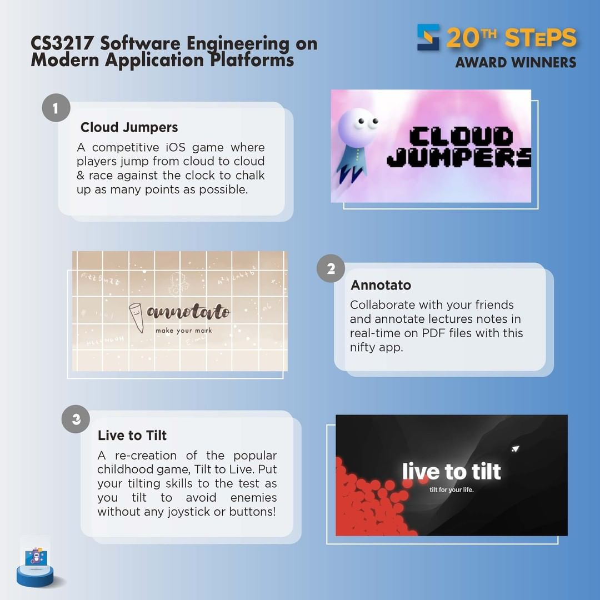

<p align="center"></p>

<h1 align="center">Annotato</h1>

<p align="center">
 &nbsp; 
</p>

## Overview

Annotato is an application that provides more than just writing and taking down notes!

Annotating your lecture notes while listening to lectures or while doing revision will never be the same again. Our application supports creating annotations from handwriting, markdown, and more. You can also share documents with your friends and collaborate with them in real-time.

You can view annotations as an overlay on the PDF file as a minimized version for you to easily skim through the entire document to get a sense of the notes you carefully made, or you can tap a particular annotation to expand it to display more information.

## Team Members

This iPadOS app is made as a final project in CS3217. Made with ❤️ by:

- [Gan Hong Yao](https://github.com/ganhongyao)
- [Han Geng Ning](https://github.com/zognin)
- [Heng Chen Kai, Darren](https://github.com/darren2pro)
- [Ruppa Nagarajan Sivayoga Subramanian](https://github.com/sivayogasubramanian)

## Demo video

The demo video can be found [here](https://www.youtube.com/embed/Yn8lnJn2OEs).

## STePS

Annotato [won the second place](https://uvents.nus.edu.sg/event/20th-steps/faq) for the 20th SoC Term Project Showcase (STePS).

<p align="center">

</p>

## Getting started

The following workflow was inspired from https://github.com/Dynavity/dynavity.

#### Setting up XcodeGen

This project uses [XcodeGen](https://github.com/yonaskolb/XcodeGen) to generate Xcode project files. As such, a prerequisite is to install XcodeGen.

1. Install XcodeGen

```sh
brew install XcodeGen
```

2. Create a copy of `Annotato/settings.yml.sample` named `Annotato/settings.yml`.

```sh
cp Annotato/settings.yml.sample Annotato/settings.yml
```

3. Open `Annotato/settings.yml` and replace `DEVELOPMENT_TEAM` and `PRODUCT_BUNDLE_IDENTIFIER` with your Team ID and a unique product bundle identifier respectively.
   One way to get your Team ID is by going to the Build settings in Xcode, choosing your team, then viewing the source file of `project.pbxproj`.

You can now generate your project settings by navigating to the directory containing `project.yml`, and executing `xcodegen`.

#### Automating project files generation

To automate the process, the following githooks can be added so that the `xcodegen` command will be executed on checkouts / pulls.

Warning: The following commands will overwrite whatever githooks you previously had for `post-checkout` and `post-merge`.

Assuming you are at the root directory of the repository, execute the following commands:

```sh
echo -e '#!/bin/sh\ncd Annotato\nxcodegen --use-cache\npod install' > .git/hooks/post-checkout
```

```sh
chmod +x .git/hooks/post-checkout
```

```sh
echo -e '#!/bin/sh\ncd Annotato\nxcodegen --use-cache\npod install' > .git/hooks/post-merge
```

```sh
chmod +x .git/hooks/post-merge
```

#### Setting up CocoaPods

[CocoaPods](https://github.com/CocoaPods/CocoaPods) is used to manage third-party dependencies such as Firebase.
Before opening the project in Xcode, run the following command in the project root directory (`Annotato/`).

```sh
sudo gem install cocoapods
```

```sh
pod install
```

Please take note of the following to avoid issues when building the project:

- Once `pod install` is done, do **not** re-run `xcodegen`. If you need to do so, re-run `pod install` after each `xcodegen`.
- Open the project in Xcode using only `Annotato.xcworkspace` and **not** `Annotato.xcodeproj`.
